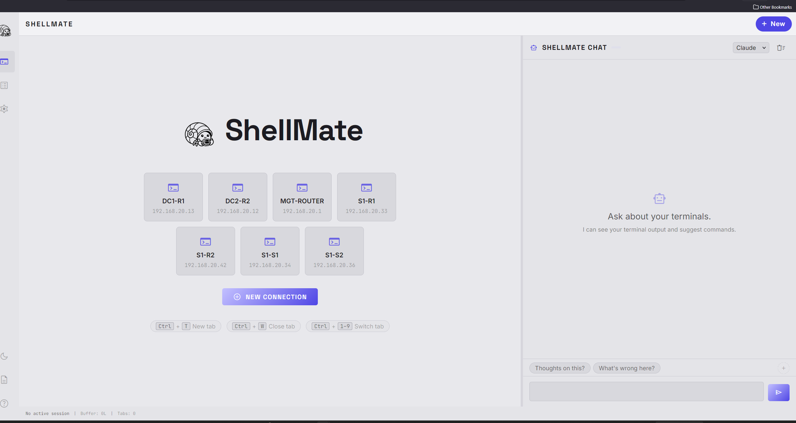

# ShellMate

A split-screen, multi-tab network terminal with a built-in agentic AI copilot. Built for network engineers working with Cisco switches, routers, firewalls and similar devices.



## What it does

- **Multi-tab SSH terminal** — connect to multiple network devices simultaneously, each in its own tab with an independent session, buffer and WebSocket
- **AI chat copilot** — Claude or Ollama sees your live terminal output and answers questions about what's on screen
- **Command suggestions** — the AI suggests CLI commands you can approve with one click; dangerous commands get a confirmation prompt
- **Saved connection profiles** — save device details (no passwords stored) for one-click reconnect from the welcome screen
- **Session-aware context** — use `/context all` or `/context 2` to pull in other tabs; the AI always knows which tab is active
- **Tab management** — drag to reorder, right-click context menu, `Ctrl+1–9` shortcuts, `Ctrl+T`/`Ctrl+W`
- **Settings panel** — font, size, colour scheme (Deep Space, Solarized Dark, Nord, One Dark, Gruvbox, Dracula, Monokai), cursor, scrollback, UI text size
- **Light / dark theme** — toggle from the sidebar
- **Smart copy/paste** — `Ctrl+C` (smart — copies selection or passes SIGINT), `Ctrl+Shift+C/V`, right-click paste dialog
- **Session logging** — optional per-session file logging to a configurable directory

## Tech stack

| Layer | Technology |
|---|---|
| Backend | Python · FastAPI · uvicorn · paramiko · pyserial |
| Frontend | Vanilla JS · xterm.js · HTML/CSS |
| AI | Claude API (Anthropic) · Ollama (local) |

## Getting started

### Requirements

- Python 3.11+
- Network access to an SSH device (or use localhost for testing)
- Claude API key **or** [Ollama](https://ollama.ai) running locally

### Install

```bash
git clone https://github.com/sjohnston1972/shellmate.git
cd shellmate
pip install -r requirements.txt
```

### Configure

```bash
cp .env.example .env
# Add your ANTHROPIC_API_KEY (or leave blank to use Ollama)
```

### Run

```bash
python run.py
```

ShellMate starts a local web server and opens your browser to `http://localhost:8765` automatically.

## Usage

| Action | How |
|---|---|
| New connection | Click **+ New** in the tab bar, or `Ctrl+T` |
| Quick connect | Click a saved device tile on the welcome screen |
| Switch tab | Click the tab, or `Ctrl+1` – `Ctrl+9` |
| Close tab | Click **×** on the tab, or `Ctrl+W` |
| Reorder tabs | Drag and drop |
| Ask the AI | Type in the chat panel on the right |
| Include all tabs in AI context | Start message with `/context all` |
| Include a specific tab | Start message with `/context 2` |
| Run AI-suggested command | Click **Send** on the command block |
| Copy terminal text | `Ctrl+C` (with selection), or `Ctrl+Shift+C` |
| Paste into terminal | `Ctrl+V` or right-click |
| Open settings | Gear icon in the left sidebar |
| Toggle light/dark theme | Moon icon in the left sidebar |

## Project structure

```
shellmate/
├── run.py                     # Entry point — starts server, opens browser
├── requirements.txt
├── .env.example               # Configuration template
├── backend/
│   ├── app.py                 # FastAPI app, REST endpoints, WebSocket handlers
│   ├── config.py              # Loads .env config
│   ├── profiles.py            # Connection profile persistence
│   ├── settings_store.py      # Application settings persistence
│   ├── connections/
│   │   ├── manager.py         # Session lifecycle (create/track/destroy by UUID)
│   │   ├── ssh_handler.py     # paramiko SSH interactive shell
│   │   └── serial_handler.py  # pyserial console
│   ├── session/
│   │   └── buffer.py          # Per-session terminal I/O buffer
│   └── ai/
│       ├── router.py          # Routes to Claude or Ollama, builds session context
│       ├── claude_client.py   # Claude API streaming client
│       ├── ollama_client.py   # Ollama streaming client
│       └── prompts.py         # Network engineer AI persona + context builder
└── frontend/
    ├── index.html
    ├── css/style.css
    └── js/
        ├── connections.js     # Connection dialog + saved profiles
        ├── tabs.js            # Tab bar management + drag reorder
        ├── terminal.js        # xterm.js init, copy/paste, settings apply
        ├── chat.js            # AI chat panel, command blocks, streaming
        ├── settings.js        # Settings panel
        └── logs.js            # Logs panel
```

## Design

ShellMate uses the *Deep Space* design system — dark background, Space Grotesk headlines, Inter UI text, and JetBrains Mono for the terminal. Built to feel like a high-performance instrument, not a SaaS dashboard. A light theme is also available.

## Security

- The web server binds to `127.0.0.1` only — not accessible from other machines
- Passwords are never stored (prompted on each connection)
- API keys live in `.env` only, never in code or profiles
- Session buffers are in-memory and cleared on disconnect (unless file logging is enabled)

## License

MIT
