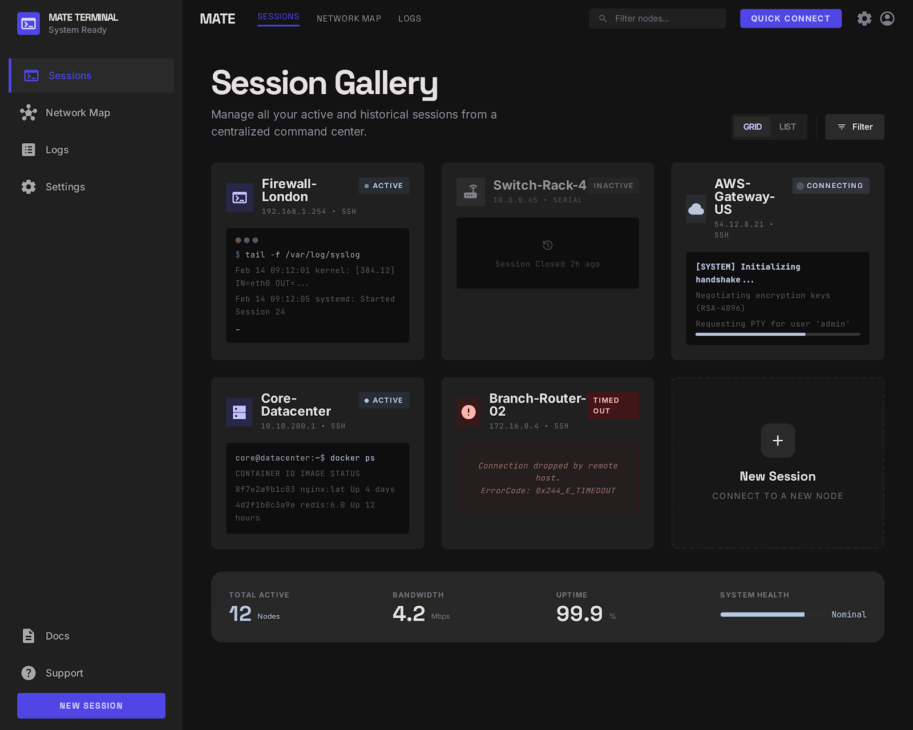

# MATE — Managed AI Terminal Environment

A split-screen, multi-tab network terminal with a built-in agentic AI copilot. Built for network engineers working with Cisco switches, routers, firewalls and similar devices.



## What it does

- **Multi-tab SSH terminal** — connect to multiple network devices simultaneously, each in its own tab with an independent session, buffer and WebSocket
- **AI chat pane** *(Phase 2 — coming soon)* — the AI can see your terminal output and suggest commands you can approve with one click
- **Saved connection profiles** — save device details (no passwords stored) for quick reconnect
- **Settings panel** — customise font, size, colour scheme (Deep Space, Solarized Dark, Nord, One Dark), scrollback, cursor style, logging
- **Session logging** — optional per-session file logging to a configurable directory
- **Smart copy/paste** — double-click to copy selection, right-click for a paste confirmation dialog
- **Serial console** *(Phase 4 — coming soon)* — connect via console cable as well as SSH

## Tech stack

| Layer | Technology |
|---|---|
| Backend | Python · FastAPI · uvicorn · paramiko · pyserial |
| Frontend | Vanilla JS · xterm.js · HTML/CSS |
| AI *(coming)* | Claude API · Ollama |

## Getting started

### Requirements

- Python 3.11+
- Network access to an SSH device (or use localhost for testing)

### Install

```bash
git clone https://github.com/sjohnston1972/mate.git
cd mate
pip install -r requirements.txt
```

### Configure

```bash
cp .env.example .env
# Edit .env — the defaults work for local use with no AI backend
```

The only required change for SSH-only use is leaving `MATE_HOST` and `MATE_PORT` at their defaults (`127.0.0.1:8765`). Add your `ANTHROPIC_API_KEY` when Phase 2 lands.

### Run

```bash
python run.py
```

MATE starts a local web server and opens your browser to `http://localhost:8765` automatically.

## Usage

| Action | How |
|---|---|
| New connection | Click **+** in the tab bar, or `Ctrl+T` |
| Switch tab | Click the tab, or `Ctrl+1` – `Ctrl+9` |
| Close tab | Click **×** on the tab, or `Ctrl+W` |
| Save a connection profile | Open connection dialog → fill hostname/username → click bookmark icon |
| Open settings | Click the gear icon in the left sidebar |
| View session logs | Click the list icon in the left sidebar |
| Copy terminal text | Double-click to select a word, text copies to clipboard |
| Paste into terminal | Right-click → confirm in the paste dialog |

## Project structure

```
mate/
├── run.py                     # Entry point — starts server, opens browser
├── requirements.txt
├── .env.example               # Configuration template
├── backend/
│   ├── app.py                 # FastAPI app, REST endpoints, WebSocket handlers
│   ├── config.py              # Loads .env config
│   ├── profiles.py            # Connection profile persistence
│   ├── settings_store.py      # Application settings persistence
│   ├── connections/
│   │   ├── manager.py         # Session lifecycle (create/track/destroy by UUID)
│   │   ├── ssh_handler.py     # paramiko SSH interactive shell
│   │   └── serial_handler.py  # pyserial console (Phase 4)
│   ├── session/
│   │   └── buffer.py          # Per-session terminal I/O buffer
│   └── ai/                    # AI routing (Phase 2)
└── frontend/
    ├── index.html
    ├── css/style.css
    └── js/
        ├── connections.js     # Connection dialog + saved profiles
        ├── tabs.js            # Tab bar management
        ├── terminal.js        # xterm.js init, copy/paste, settings apply
        ├── settings.js        # Settings panel
        └── logs.js            # Logs panel
```

## Build phases

- [x] **Phase 1** — Multi-tab SSH terminal with session management
- [ ] **Phase 2** — Split-screen AI chat pane (Claude / Ollama)
- [ ] **Phase 3** — AI command suggestions with one-click approval
- [ ] **Phase 4** — Serial console support
- [ ] **Phase 5** — Connection profiles polish, tab reordering, reconnect

## Design

MATE uses the *Intelligent Monolith* design system — a deep space colour palette, Space Grotesk headlines, Inter UI text, and JetBrains Mono for the terminal. Built to feel like a high-performance instrument, not a SaaS dashboard.

## Security

- The web server binds to `127.0.0.1` only — not accessible from other machines
- Passwords are never stored (prompted on each connection)
- API keys live in `.env` only, never in code or profiles
- Session buffers are in-memory and cleared on disconnect (unless file logging is enabled)

## License

MIT
